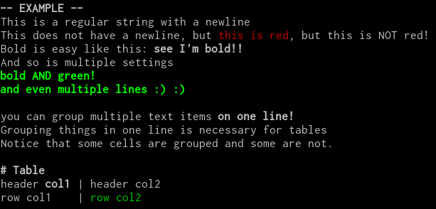

**termstyle** is a library that aims to make it easy to build **formatted** and
**styled** command line applications.

It supports the following "elements":
- **styled-text**
    - italic
    - bold
    - colors
- **tables**: composed of styled text with identical width columns

Text can be constructed programatically by pushing tokens onto a vector and
then `paint()`ing them, or by parsing a yaml file. This allows you to easily
write unit tests for your command line applications.

## Example
Given the following config (written in yaml):
```yaml
- {t: "-- EXAMPLE --\n", b: true}
- "This is a regular string with a newline\n"
- "This does not have a newline, but "
- {t: "this is red", c: red}
- ", but this is NOT red!\n"
- "Bold is easy like this: "
- {t: "see I'm bold!!\n", b: true}
- And so is multiple settings
- # long-form
  t: |

      bold AND green!
      and even multiple lines :) :)
  b: true
  c: green
- ["\nyou can group multiple text items ", {t: "on one line!", b: true}]
- "\nGrouping things in one line is necessary for tables\n"
- "Notice that some cells are grouped and some are not.\n\n"
- [{t: "# Table", b: true}, "\n"]
-
  table:
  - [["header ", {t: "col1", b: true}] ,"| header col2"]
  - ["row col1", ["| ", {t: "row col2", c: green}]]
```

Use the following to render it:

```rust
let els = termstyle::from_str(serde_yaml::from_str, example).unwrap();
termstyle::paint(&mut ::std::io::stdout(), &els).unwrap();
```

Which gets rendered as:



You can also create the "stream of elements" using the types provided by the
library.  For more information, see the library docs.

